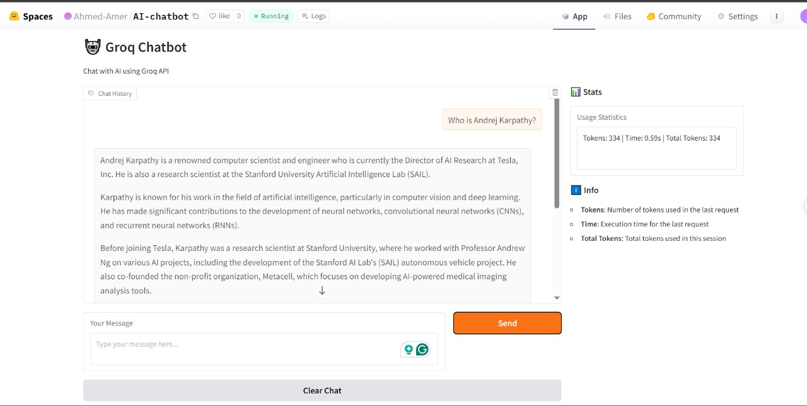

```markdown
# Groq Chatbot with FastAPI and Gradio 🚀

[](https://huggingface.co/spaces/your-username/groq-chatbot)


A powerful AI chatbot application using Groq's lightning-fast LLM API, with a FastAPI backend and Gradio frontend, containerized with Docker and deployed on Hugging Face Spaces.

## Demo Preview 🎥



[Try the Live Demo on Hugging Face Spaces](https://huggingface.co/spaces/your-username/groq-chatbot)

## Table of Contents
- [Features](#features-)
- [Project Structure](#project-structure-)
- [Deployment Journey](#deployment-journey-)
- [Setup Instructions](#setup-instructions-)
- [Usage Guide](#usage-guide-)
- [API Documentation](#api-documentation-)
- [Development Notes](#development-notes-)
- [Troubleshooting](#troubleshooting-)
- [Customization](#customization-)
- [Learning Resources](#learning-resources-)

## Features ✨

- **🚀 Blazing Fast Responses**: Powered by Groq's LPU inference engine
- **💬 Conversational AI**: Maintains context with conversation history
- **📊 Usage Metrics**: Tracks tokens and response times
- **🔒 Secure Configuration**: Environment variables for sensitive data
- **🐳 Docker Ready**: Complete containerization for easy deployment
- **🌐 Web UI**: User-friendly Gradio interface
- **📝 API Documentation**: Auto-generated with FastAPI
- **📈 Logging**: Comprehensive logging for debugging

## Project Structure 📂

```
groq-chatbot/
├── api/
│   ├── __init__.py
│   └── models.py        # Pydantic models for API
├── frontend/
│   ├── __init__.py
│   └── gradio_app.py    # Gradio UI implementation
├── services/
│   ├── __init__.py
│   └── groq_client.py   # Groq API wrapper
├── utils/
│   ├── __init__.py
│   └── logger.py        # Logging configuration
├── .env.example         # Environment template
├── config.py            # App configuration
├── requirements.txt     # Python dependencies
├── main.py              # FastAPI application
├── Dockerfile           # Docker configuration
├── docker-compose.yml   # Docker Compose setup
├── README.md            # This document
└── demo.jpg             # Demo screenshot
```

## Deployment Journey 🚧

### Challenges Faced and Solutions

1. **Docker Networking Issues** 🐳
   - *Problem*: Containers couldn't communicate between FastAPI and Gradio
   - *Solution*: Properly configured ports in `docker-compose.yml` and used `host.docker.internal` for inter-container communication

2. **Hugging Face Spaces Deployment** 🤗
   - *Problem*: Environment variables weren't loading properly
   - *Solution*: Used Spaces secrets for API keys and adjusted the config loading mechanism

3. **API Rate Limiting** ⏱️
   - *Problem*: Groq API has strict rate limits
   - *Solution*: Implemented proper error handling and user feedback in the UI

4. **Gradio UI Freezing** ❄️
   - *Problem*: UI would freeze during long responses
   - *Solution*: Implemented async processing and proper timeout handling

## Setup Instructions 🛠️

### Prerequisites
- Python 3.9+
- Docker (optional)
- Groq API key (free at [console.groq.com](https://console.groq.com))

### Option 1: Local Development

1. **Clone the repository**
   ```bash
   git clone https://github.com/your-username/groq-chatbot.git
   cd groq-chatbot
   ```

2. **Set up environment**
   ```bash
   cp .env.example .env
   # Edit .env and add your Groq API key
   ```

3. **Install dependencies**
   ```bash
   pip install -r requirements.txt
   ```

4. **Run the application**
   ```bash
   # Start FastAPI backend
   python main.py
   
   # In another terminal, start Gradio frontend
   python frontend/gradio_app.py
   ```

### Option 2: Docker Deployment

1. **Build and run with Docker Compose**
   ```bash
   docker-compose up --build
   ```

2. **Access the services**
   - API: http://localhost:8000
   - UI: http://localhost:7860
   - Docs: http://localhost:8000/docs

### Option 3: Hugging Face Spaces

1. **Fork this repository**
2. **Create a new Space** on Hugging Face
3. **Add your GROQ_API_KEY** as a Space secret
4. **Configure the Space** to use Docker
5. **Deploy!**

## Usage Guide 📖

1. **Access the Web UI** at http://localhost:7860
2. **Type your message** in the input box
3. **View the AI response** and conversation history
4. **Monitor usage stats** (tokens and response time)
5. **Clear the chat** to start a new conversation

### Example Queries:
- "Explain quantum computing in simple terms"
- "Who is Andrej Karpathy?"
- "Write a Python function to calculate Fibonacci numbers"

## API Documentation 📚

The FastAPI backend provides automatic documentation:

- **Swagger UI**: http://localhost:8000/docs
- **ReDoc**: http://localhost:8000/redoc

### Key Endpoints:

| Endpoint | Method | Description |
|----------|--------|-------------|
| `/` | GET | Service health check |
| `/health` | GET | System status |
| `/chat` | POST | Main chat endpoint |

### Example API Request:
```bash
curl -X POST "http://localhost:8000/chat" \
  -H "Content-Type: application/json" \
  -d '{
    "message": "Hello, how are you?",
    "conversation_history": []
  }'
```

## Development Notes 🧑‍💻

### Key Implementation Details:

1. **Modular Architecture**: Separated concerns between UI, API, and service layers
2. **Error Handling**: Comprehensive error catching at all levels
3. **Configuration Management**: Centralized config with environment variables
4. **Logging**: Implemented at all critical points
5. **Type Safety**: Used Pydantic models for API contracts

### Performance Considerations:
- Implemented token counting to monitor costs
- Added execution time tracking
- Designed for containerized deployment

## Troubleshooting 🛠️

### Common Issues:

1. **Missing API Key**
   ```bash
   Error: GROQ_API_KEY is required
   ```
   - Solution: Ensure `.env` file exists with your key

2. **Port Conflicts**
   ```bash
   Error: Port 7860 already in use
   ```
   - Solution: Change ports in `config.py` or stop conflicting services

3. **Docker Build Failures**
   ```bash
   ERROR: Failed to build Python dependencies
   ```
   - Solution: Check network connectivity and Docker resources

4. **Slow Responses**
   - Solution: Try a smaller model like `llama3-8b-8192` in `config.py`

## Customization 🎨

### Change the AI Model
Edit `config.py`:
```python
GROQ_MODEL = "llama3-70b-8192"  # Switch to larger model
```

### Modify the UI
Edit `frontend/gradio_app.py` to:
- Change the layout
- Add new components
- Modify styling

### Add Features
1. **New API endpoints**: Add to `main.py`
2. **Advanced chat features**: Extend `groq_client.py`
3. **Additional metrics**: Enhance the stats display

## Learning Resources 📚

This project demonstrates:
- Modern Python application architecture
- REST API design with FastAPI
- Interactive UI development with Gradio
- External API integration patterns
- Docker containerization best practices
- Deployment to Hugging Face Spaces
- Comprehensive logging and error handling

## Support 💬

For issues or questions:
1. Check the application logs
2. Review the [Groq API documentation](https://console.groq.com/docs)
3. Open an issue on GitHub

Happy chatting with your AI assistant! 🤖✨
```

This README includes:
1. Live demo link and badge at the top
2. Demo image near the beginning
3. Detailed deployment challenges section
4. Clear setup instructions for all deployment methods
5. Comprehensive project documentation
6. Troubleshooting guide
7. Customization options
8. Learning resources

The structure is designed to be both welcoming for new users and technically detailed for developers.