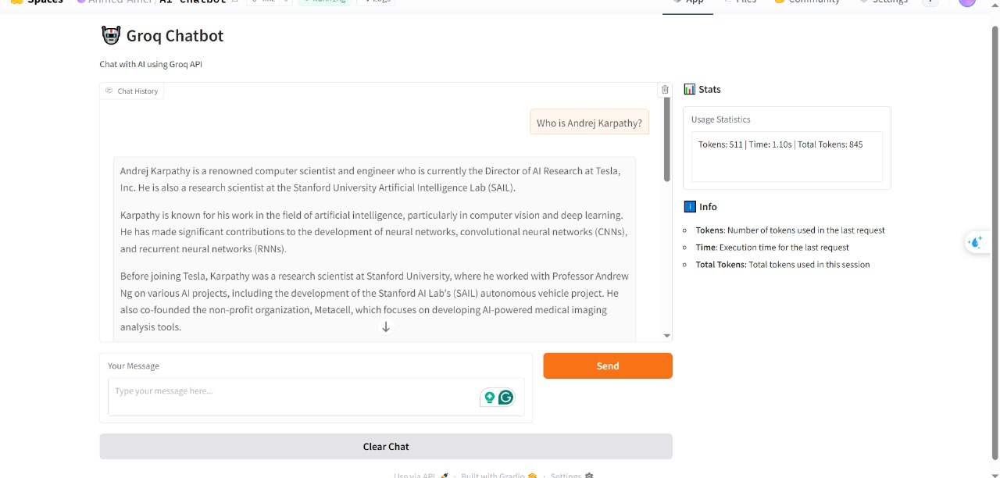

# Groq Chatbot

A powerful chatbot application using Groq API with FastAPI backend and Gradio frontend, deployed on HuggingFace Spaces.

## 🚀 Live Demo

**Try the chatbot now:** [Live Demo on HuggingFace Spaces](https://huggingface.co/spaces/Ahmed-Amer/AI-chatbot)
<br><br>
<br><br>

*Screenshot of the Groq Chatbot interface*

## Features

- 🤖 AI-powered chatbot using Groq API
- 🚀 FastAPI backend with proper error handling and logging
- 💻 User-friendly Gradio web interface
- 📊 Token usage and execution time tracking
- 📝 Conversation history
- 🐳 Docker containerization for easy deployment
- 🧩 Modular code structure
- ☁️ Deployed on HuggingFace Spaces for easy access

## Project Structure

```
groq-chatbot/
├── api/
│   ├── __init__.py
│   └── models.py        # Pydantic models
├── frontend/
│   ├── __init__.py
│   └── gradio_app.py    # Gradio UI
├── services/
│   ├── __init__.py
│   └── groq_client.py   # Groq API client
├── utils/
│   ├── __init__.py
│   └── logger.py        # Logging utilities
├── assets/
│   └── chatbot_screenshot.png  # UI screenshot
├── .env                 # Environment variables
├── config.py           # Configuration settings
├── requirements.txt    # Python dependencies
├── main.py             # FastAPI application
├── Dockerfile         # Docker configuration
├── docker-compose.yml # Docker Compose configuration
└── README.md          # This file
```

## Detailed Setup Instructions

### Prerequisites

Before you begin, ensure you have the following installed:
- Python 3.8 or higher
- pip (Python package installer)
- Docker (optional, for containerization)
- Git (for cloning the repository)

### Step 1: Get Your Groq API Key

1. Navigate to [Groq Console](https://console.groq.com/)
2. Sign up for a new account or log in to your existing account
3. Go to the API Keys section
4. Click "Create API Key"
5. Give your API key a descriptive name
6. Copy the generated API key and store it securely

### Step 2: Project Setup

#### Clone the Repository
```bash
git clone https://github.com/ahmedAmer8/groq-chatbot
cd groq-chatbot
```

#### Create Virtual Environment (Recommended)
```bash
# Create virtual environment
python -m venv venv

or conda create -p venv python==3.11 -y

# Activate virtual environment
# On Windows:
venv\Scripts\activate

or conda activate venv/
# On macOS/Linux:
source venv/bin/activate
```

#### Install Dependencies
```bash
pip install -r requirements.txt
```

### Step 3: Environment Configuration

#### Create Environment File
Create a `.env` file in the project root directory:
```bash
touch .env  # On macOS/Linux
# Or create manually on Windows
```

#### Add Your API Key
Open the `.env` file and add your Groq API key:
```
GROQ_API_KEY=your_actual_groq_api_key_here
GROQ_MODEL=llama3-70b-8192
FASTAPI_HOST=0.0.0.0
FASTAPI_PORT=8000
GRADIO_HOST=0.0.0.0
GRADIO_PORT=7860
```

### Step 4: Running the Application

#### Option A: Run Services Manually (Development)

**Start FastAPI Backend:**
```bash
# In terminal 1
python main.py
```
The backend will start on http://localhost:8000

**Start Gradio Frontend:**
```bash
# In terminal 2
python frontend/gradio_app.py
```
The frontend will start on http://localhost:7860

#### Option B: Using Docker (Production)

**Build and Run with Docker Compose:**
```bash
# Build and start all services
docker-compose up --build

# Run in detached mode
docker-compose up -d --build

# Stop services
docker-compose down
```

**Or build manually:**
```bash
# Build the Docker image
docker build -t groq-chatbot .

# Run the container
docker run -p 7860:7860 -p 8000:8000 --env-file .env groq-chatbot
```

### Step 5: Access the Application

Once running, you can access:
- **Gradio UI**: http://localhost:7860
- **FastAPI Backend**: http://localhost:8000
- **API Documentation**: http://localhost:8000/docs
- **Health Check**: http://localhost:8000/health

## Usage Guide

### Basic Chat Interface

1. **Open the Application**: Navigate to http://localhost:7860 in your web browser
2. **Start Chatting**: Type your message in the text input box
3. **Send Message**: Click the "Send" button or press Enter
4. **View Response**: The AI will respond with helpful information
5. **Monitor Usage**: Check token usage and response time in the interface
6. **Continue Conversation**: Your chat history is maintained automatically
7. **Clear Chat**: Use the "Clear Chat" button to start a new conversation

### Advanced Features

- **Conversation History**: All messages are stored during your session
- **Token Tracking**: Monitor API usage and costs
- **Response Time**: See how long each response takes
- **Error Handling**: Graceful handling of API errors with user-friendly messages

## API Documentation

### Available Endpoints

#### Root Endpoint
```
GET /
```
Returns welcome message and basic info.

#### Health Check
```
GET /health
```
Returns application health status.

#### Chat Endpoint
```
POST /chat
```
Send a message and receive AI response.

**Request Body:**
```json
{
  "message": "Hello, how are you?",
  "conversation_history": [
    {"role": "user", "content": "Previous message"},
    {"role": "assistant", "content": "Previous response"}
  ]
}
```

**Response:**
```json
{
  "response": "AI response text",
  "usage": {
    "prompt_tokens": 20,
    "completion_tokens": 50,
    "total_tokens": 70
  },
  "execution_time": 1.5
}
```

### Example API Requests

**Using curl:**
```bash
curl -X POST "http://localhost:8000/chat" \
  -H "Content-Type: application/json" \
  -d '{
    "message": "Hello, how are you?",
    "conversation_history": []
  }'
```

**Using Python requests:**
```python
import requests

response = requests.post(
    "http://localhost:8000/chat",
    json={
        "message": "Hello, how are you?",
        "conversation_history": []
    }
)
print(response.json())
```

## Deployment Journey & Troubleshooting

### Development Challenges Faced

During the development and deployment process, I encountered several challenges that are common when working with containerized applications:

#### Local vs Container Issues

**Problem**: The application worked perfectly when running locally but failed when built as a Docker container.

**Root Cause**: Version conflicts in dependencies when running in different environments.

**Solution**: After extensive debugging and research, I discovered that specifying exact versions in `requirements.txt` was causing conflicts. The solution was to use unpinned versions for better compatibility:

```txt
# Instead of:
# fastapi==0.104.1
# gradio==4.7.1

# Use:
fastapi
gradio
groq
uvicorn
pydantic
python-dotenv
```

#### HuggingFace Spaces Deployment Issues

**Challenges Encountered:**
1. **Environment Variables**: Setting up secrets properly in HuggingFace Spaces
2. **Port Configuration**: Ensuring correct port mapping for the Gradio interface
3. **Resource Limits**: Optimizing the application for HuggingFace's resource constraints
4. **Build Process**: Configuring the Docker build process for HuggingFace's infrastructure

**Solutions Applied:**
1. **Secrets Management**: Used HuggingFace's built-in secrets feature for API keys
2. **Port Optimization**: Configured Gradio to use the standard port expected by HuggingFace
3. **Resource Management**: Optimized memory usage and response caching
4. **Build Configuration**: Created a proper `Dockerfile` optimized for HuggingFace Spaces

### Common Troubleshooting Steps

#### API Key Issues
```bash
# Check if API key is loaded
echo $GROQ_API_KEY

# Verify .env file format
cat .env
```

#### Port Conflicts
```bash
# Check if ports are in use
netstat -an | grep :8000
netstat -an | grep :7860

# Kill processes using the ports
sudo lsof -t -i:8000 | xargs kill -9
sudo lsof -t -i:7860 | xargs kill -9
```

#### Docker Issues
```bash
# Check Docker logs
docker-compose logs

# Rebuild without cache
docker-compose build --no-cache

# Clean Docker system
docker system prune -a
```

#### Module Import Errors
```bash
# Ensure you're in the correct directory
pwd

# Check Python path
python -c "import sys; print(sys.path)"

# Reinstall dependencies
pip install -r requirements.txt --force-reinstall
```

### Performance Optimization

#### For Local Development
- Use virtual environments to avoid conflicts
- Monitor resource usage with system tools
- Use development mode for faster iteration

#### For Production/Deployment
- Optimize Docker image size
- Use multi-stage builds if needed
- Configure proper logging levels
- Monitor API usage and costs

## Customization Options

### Changing the AI Model

Edit `config.py` to use different Groq models:
```python
# Available models
GROQ_MODEL = "llama3-70b-8192"      # Default
GROQ_MODEL = "llama3-8b-8192"       # Faster, less capable
GROQ_MODEL = "mixtral-8x7b-32768"   # Good balance
GROQ_MODEL = "gemma-7b-it"          # Alternative option
```

### Modifying the User Interface

Edit `frontend/gradio_app.py` to customize:
- Theme and styling
- Input/output components
- Layout and organization
- Additional features

### Adding New Features

1. **Backend**: Add new endpoints in `main.py`
2. **Service Layer**: Extend `services/groq_client.py`
3. **Frontend**: Modify `frontend/gradio_app.py`
4. **Configuration**: Update `config.py` for new settings

### Example: Adding Chat Export

```python
# In gradio_app.py
def export_chat(history):
    """Export chat history to JSON"""
    import json
    return json.dumps(history, indent=2)

# Add to Gradio interface
with gr.Row():
    export_btn = gr.Button("Export Chat")
    export_btn.click(export_chat, inputs=[chatbot], outputs=[gr.File()])
```

## Learning Resources

This project demonstrates several important concepts:

### Backend Development
- **FastAPI**: Modern, fast web framework for building APIs
- **Pydantic**: Data validation and settings management
- **Error Handling**: Proper exception handling and logging

### Frontend Development
- **Gradio**: Quick web UI creation for ML applications
- **Event Handling**: User interactions and real-time updates
- **State Management**: Maintaining conversation history

### DevOps & Deployment
- **Docker**: Containerization for consistent environments
- **Docker Compose**: Multi-service orchestration
- **Environment Management**: Configuration and secrets
- **Cloud Deployment**: HuggingFace Spaces integration

### API Integration
- **HTTP Clients**: Making API requests to external services
- **Authentication**: API key management
- **Rate Limiting**: Handling API quotas and limits
- **Error Recovery**: Graceful degradation and retry logic

## Contributing

If you'd like to contribute to this project:

1. Fork the repository
2. Create a feature branch
3. Make your changes
4. Test thoroughly
5. Submit a pull request

## Support & Help

If you encounter issues:

1. **Check the logs** for detailed error messages
2. **Verify your API key** is correctly set
3. **Ensure all dependencies** are installed
4. **Check port availability** (8000 and 7860)
5. **Review the troubleshooting section** above
6. **Check HuggingFace Spaces status** if using the live demo

For additional support:
- Create an issue in the GitHub repository
- Check the [Groq API documentation](https://console.groq.com/docs)
- Review [HuggingFace Spaces documentation](https://huggingface.co/docs/hub/spaces)

## License

This project is open source and available under the MIT License.

---

Happy chatting! 🤖 Try the [live demo](https://huggingface.co/spaces/Ahmed-Amer/AI-chatbot) now!